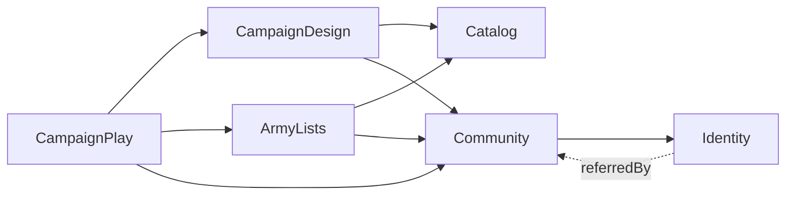

# Modelo de dominio

Un archivo por bounded context. Cada diagrama muestra el contexto completo. Las clases de otros contextos aparecen vacías y con el nombre de su contexto como estereotipo (p. ej. `<<Community>>`): solo indican a qué se referencia por ID.

| Contexto | Responsabilidad |
|---|---|
| [Identity](identity.md) | Login: cuentas, sesiones, tokens, consentimientos |
| [Community](community.md) | Perfil público: jugadores, organizaciones (tienda, club, partner) y membresías |
| [Catalog](catalog.md) | Juegos, facciones y perfiles de unidad de cada juego |
| [ArmyLists](army-lists.md) | Listas de ejército: escuadras, unidades y puntos |
| [CampaignDesign](campaign-design.md) | Plantilla de campaña: grafo de nodos/aristas con condiciones y mapas hexagonales |
| [CampaignPlay](campaign-play.md) | Partida en curso de una campaña: resultados, condiciones y territorios |

## Mapa de contextos

La flecha significa "referencia IDs de".

## Leyenda

- `AggregateRoot`: raíz de consistencia y de transacción. Tiene su propio repositorio.
- `Entity`: tiene identidad, pero solo existe dentro de su agregado.
- `ValueObject`: inmutable, se compara por valor.
- `*--` composición dentro del agregado · `..>` referencia por ID a otro agregado.
