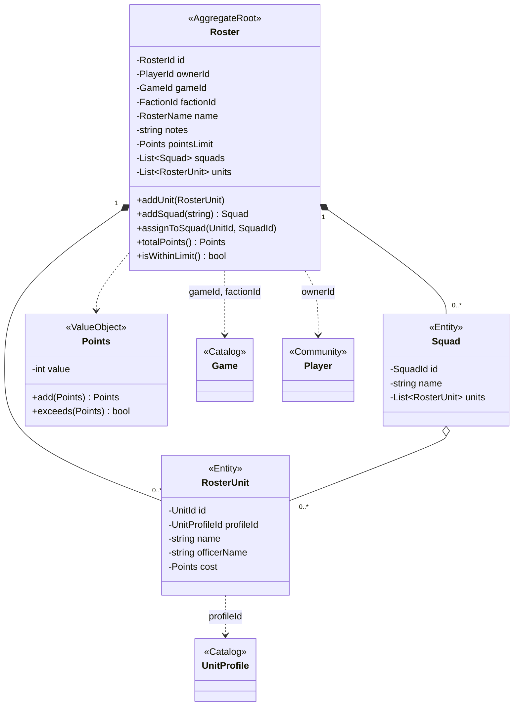

# ArmyLists

`RosterUnit` guarda una copia del nombre y el coste para que una lista no cambie cuando se actualicen los puntos oficiales en [Catalog](catalog.md).

Invariante del agregado: una unidad solo puede estar en una escuadra, y la escuadra debe pertenecer a la misma lista. Lo garantiza `Roster::assignToSquad()`.
