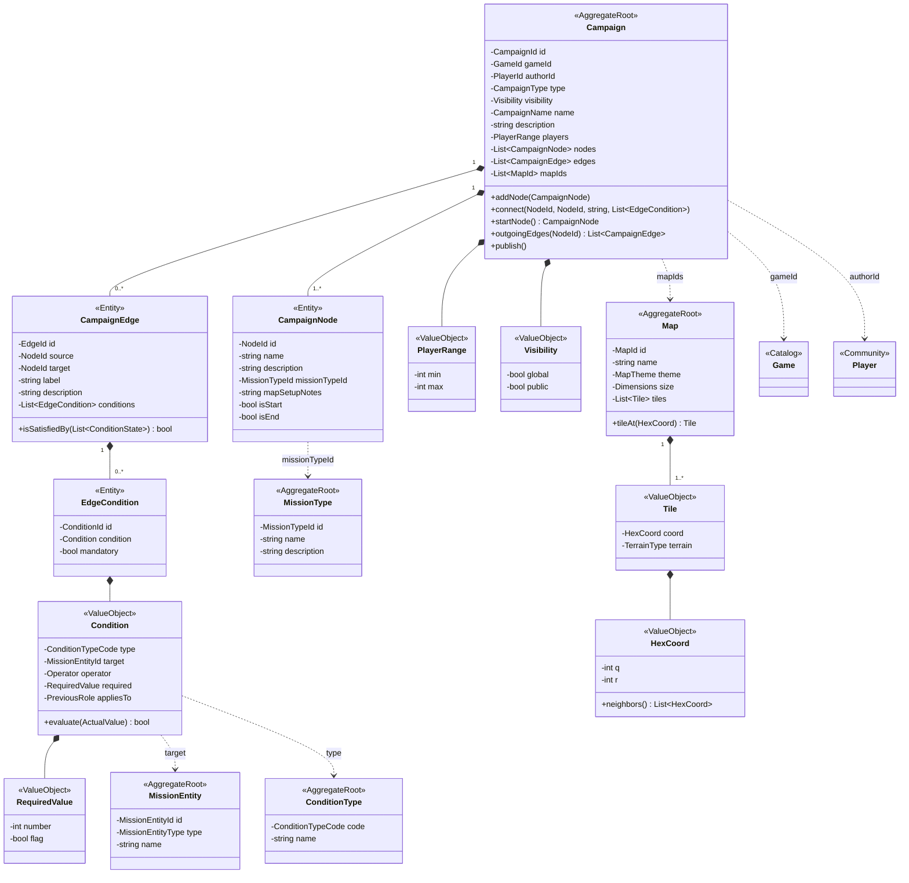

# CampaignDesign

La plantilla de una campaña: un grafo de nodos (misiones) y aristas (transiciones) con condiciones, más los mapas hexagonales para las campañas de mundo abierto.

Enums: `CampaignType` (LINEAR, BRANCHING, OPEN_WORLD), `Operator` (EQUALS, NOT_EQUALS, GREATER_THAN, LESS_THAN, IN_LIST), `PreviousRole` (WINNER, LOSER, PLAYER_A, PLAYER_B, ANY), `TerrainType`, `MapTheme`, `MissionEntityType`.
