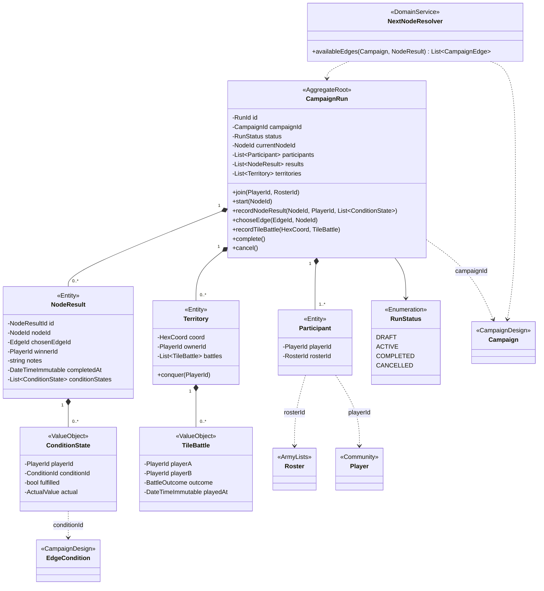

# CampaignPlay

Una partida concreta de una campaña de [CampaignDesign](campaign-design.md). `NextNodeResolver` es un servicio de dominio porque necesita la plantilla (`Campaign`) y el estado (`CampaignRun`) a la vez.

Nullables: `currentNodeId`, `chosenEdgeId`, `notes`, `Territory.ownerId` (casillas neutrales).
