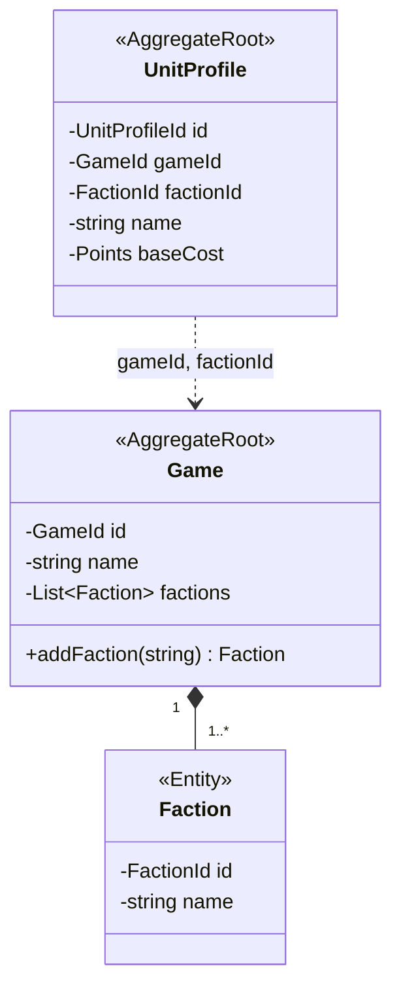

# Catalog

Datos de referencia de cada juego. `UnitProfile` es la base del importador multijuego: contra él se valida cada unidad de una lista.

```mermaid
classDiagram
direction TB
class Game {
  <<AggregateRoot>>
  -GameId id
  -string name
  -List~Faction~ factions
  +addFaction(string) Faction
}
class Faction {
  <<Entity>>
  -FactionId id
  -string name
}
class UnitProfile {
  <<AggregateRoot>>
  -UnitProfileId id
  -GameId gameId
  -FactionId factionId
  -string name
  -Points baseCost
}
Game "1" *-- "1..*" Faction
UnitProfile ..> Game : gameId, factionId
```
