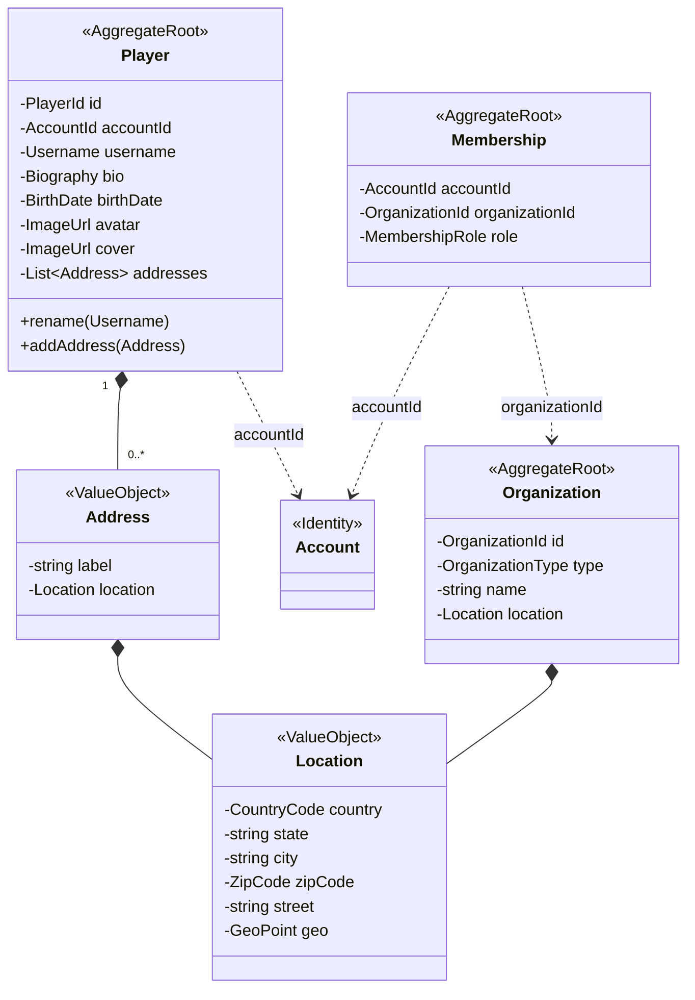

# Community

Perfil público. Tienda, club y partner son `Organization` con distinto `OrganizationType`. La relación con la cuenta la da `Membership`.

`city`, `zipCode` y `street` son obligatorios para tiendas. Esa regla la valida `Organization`, no `Location`.
