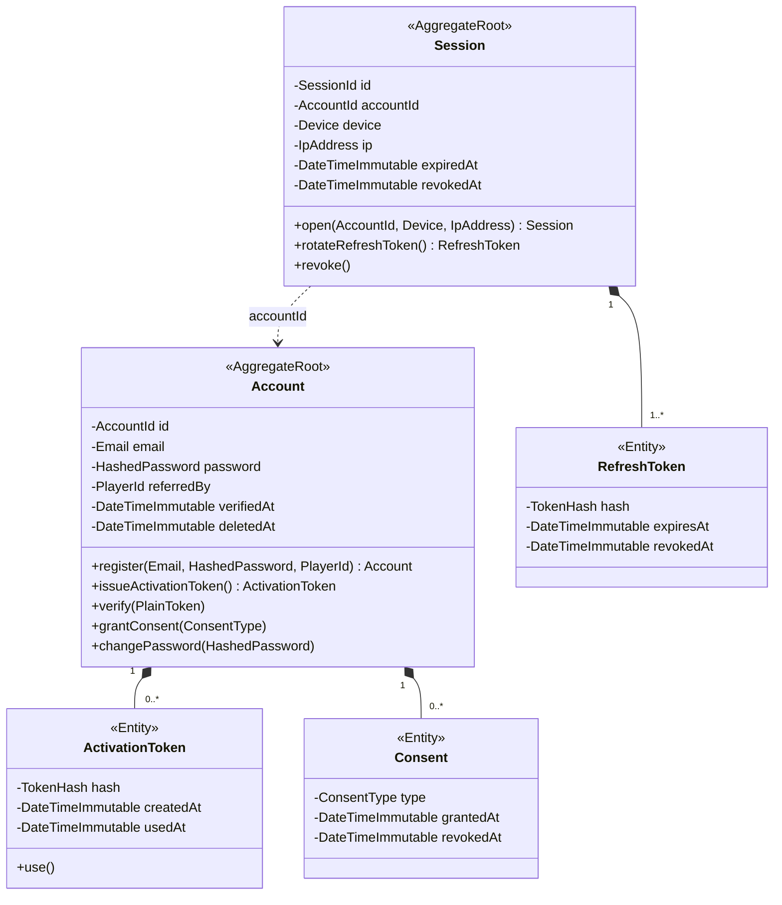

# Identity

Solo datos de login. El perfil público vive en [Community](community.md).

```mermaid
classDiagram
direction TB
class Account {
  <<AggregateRoot>>
  -AccountId id
  -Email email
  -HashedPassword password
  -PlayerId referredBy
  -DateTimeImmutable verifiedAt
  -DateTimeImmutable deletedAt
  +register(Email, HashedPassword, PlayerId) Account
  +issueActivationToken() ActivationToken
  +verify(PlainToken)
  +grantConsent(ConsentType)
  +changePassword(HashedPassword)
}
class ActivationToken {
  <<Entity>>
  -TokenHash hash
  -DateTimeImmutable createdAt
  -DateTimeImmutable usedAt
  +use()
}
class Consent {
  <<Entity>>
  -ConsentType type
  -DateTimeImmutable grantedAt
  -DateTimeImmutable revokedAt
}
class Session {
  <<AggregateRoot>>
  -SessionId id
  -AccountId accountId
  -Device device
  -IpAddress ip
  -DateTimeImmutable expiredAt
  -DateTimeImmutable revokedAt
  +open(AccountId, Device, IpAddress) Session
  +rotateRefreshToken() RefreshToken
  +revoke()
}
class RefreshToken {
  <<Entity>>
  -TokenHash hash
  -DateTimeImmutable expiresAt
  -DateTimeImmutable revokedAt
}
Account "1" *-- "0..*" ActivationToken
Account "1" *-- "0..*" Consent
Session "1" *-- "1..*" RefreshToken
Session ..> Account : accountId
```

Nullables: `referredBy`, `verifiedAt`, `deletedAt`, `usedAt`, `revokedAt`, `expiredAt`.
